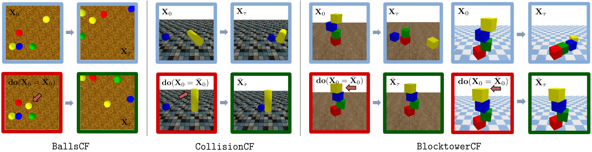

# COPHY: Counterfactual Learning of Physical Dynamics

This repository contains the dataloaders for the benchmark introduced in ["COPHY: Counterfactual Learning of Physical Dynamics", F. Baradel, N. Neverova, J. Mille, G. Mori, C. Wolf, ICLR'2020](https://arxiv.org/abs/1909.12000).

Links: [Project page](https://projet.liris.cnrs.fr/cophy/) | [Data (soming soon)](./)



More information coming soon

## Citation
If you find this paper or the benchmark useful for your research, please cite our paper.
```
@InProceedings{Baradel_2020_ICLR,
author = {Baradel, Fabien and Neverova, Natalia and Mille, Julien and Mori, Greg and Wolf, Christian},
title = {COPHY: Counterfactual Learning of Physical Dynamics},
booktitle = {ICLR},
year = {2020}
}
```

## Acknowledgements
This work was funded by grant Deepvision (ANR-15- CE23-0029, STPGP-479356-15), a joint French/Canadian call by ANR & NSERC.

